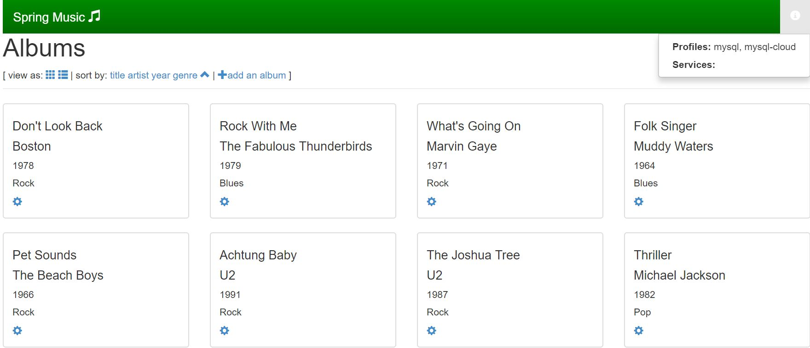

# helmi
Open Service Broker API Implementation using helm client api &amp; kubernetes client api


## Start locally (Dev)

```console
# start minikube
minikube start

# init helm and install tiller (needed once)
helm init

# build helmi
go get -d github.com/monostream/helmi
cd ${GOPATH:-~/go}/src/github.com/monostream/helmi
go build

# run helmi
./helmi -config catalog.yaml
```

## Start on kubernetes (Test)

```console
# create serviceaccount, clusterrolebinding, deployment, service and an optional secret for basic authorization
kubectl create -f docs/kubernetes/kube-helmi-rbac.yaml
kubectl create -f docs/kube-helmi-secret.yaml
kubectl create -f docs/kubernetes/kube-helmi.yaml

# curl to catalog with basic auth
curl --user {username}:{password} http://$(kubernetes ip):30000/v2/catalog
```
or
```console
./docs/kubernetes/deploy.sh

# curl to catalog with basic auth
curl --user {username}:{password} http://$(kubernetes ip):30000/v2/catalog
```

## Start with kube helm (Current)

Configure the values.

| Parameter               | Description                            | Default                   |
| ----------------------- | -------------------------------------- | ------------------------- |
| `helmi.username`|This is the helmi service broker username.|admin|
| `helmi.password`|This is the helmi service broker password.|helmi|
| `helmi.repo_url`|This is the chart repo url,default is google repo.|""|
| `helmi.repo_name`|This is the chart repo name.|""|
| `ingress.hosts`|The helmi ingress hosts.|"helmi-service-broker.k8s.io"|
| `kubeconfig.*`|Must set the kubeconfig,support oidc,token.|"xxxxxx"|
| `tls.cacert`|Must set the kube ca cert.|"xxxxxx"|
| `service_config.services.*`|Support backend services,contain the service repo and version.|"mariadb,redis,mongodb,minio,rabbitmq,cassandra"|
| `service_config.loglevel`|log level|DEBUG|
| `service_config.allow_user_bind_parameters`|when we bind service instance, can with parameter|true|
| `service_config.allow_user_provision_parameters`|when we create service instance, can with parameter|true|
| `service_config.allow_user_update_parameters`|when we update service instance, can with parameter|true|
| `service_config.allow_user_bind_parameters`|when we bind service instance, can with parameter|true|
| `service_config.cluster_dns_name`|kubernetes provide 4 service type, if use cluster ip, maybe use it.|svc.cluster.local|
| `helmi.tillerhost`|tiller server host,default is ""|""|
| `helmi.namespace`|tiller server namespace|kube-system|
| `helmi.home`|helm client home director|".helm"|
| `helmi.connection_timeout`|helm client connection server timeout|60|
| `helmi.repos`|set of repository url and name|stable->google.....|
|`chart-offline mode`|service catalog support offline chart file|catalog/service_name/xxx.tgz|

Install the helmi release.

```
helm install -n helmi-core --namespace helmi-system .
```

Register the broker.

**Note** Modify the example/service-broker.yaml ingress url and username password base64.

```
# kubectl create -f example/service-broker.yaml
```

Test the helmi url with ingress.

```
curl -k 'https://helmi-service-broker.k8s.io/v2/catalog' -i -X GET \
     -H 'Accept: application/json' \
     -H 'Content-Type: application/x-www-form-urlencoded' \
     -u 'admin:helmi'
```

Create mariadb instance.
```
curl -k 'https://helmi-service-broker.k8s.io/v2/service_instances/3b2e7d2c915242a5befcf03e1c3f47cd' -X PUT \
-H 'Accept: application/json' \
-H 'Content-Type: application/x-www-form-urlencoded' \
-u 'admin:helmi' \
-d '{"service_instance_guid":"a0029c76-7017-4a74-94b0-54a04ad94b80","plan_id":"e79306ef-4e10-4e3d-b38e-ffce88c90f59","service_id":"ab53df4d-c279-4880-94f7-65e7d72b7834","app_guid":"081d55a0-1bfa-4e51-8d08-273f764988db","context": {"platform":"kubernetes","namespace":"mariadb-test"},"parameters":{"serviceType":"NodePort"},"name":"mariadb-service"}'
```

Delete mariadb install.

```
curl -k 'https://helmi-service-broker.k8s.io/v2/service_instances/3b2e7d2c915242a5befcf03e1c3f47cd' -i -X DELETE \
-H 'Accept: application/json' \
-H 'Content-Type: application/x-www-form-urlencoded' \
-u 'admin:helmi'
```
## Use in Kubernetes example

If we install it with helm, we can list the service broker on kubernetes
```
# kubectl get clusterservicebroker
NAME                   URL
helmi-service-broker   http://helmi-service-broker.k8s.io
```

List the service class
```
# kubectl get clusterserviceclasses
```

List the service plans
```
# kubectl get clusterserviceplans
```

Create service instance with parameters

**Note:** the service instance may contain some parameters,and the parameter should be defined in your helm repo chart.
```
# kubectl create -f example/service_instance.yaml

# kubectl describe ServiceInstance mariadb-service-instance
```

Bind a service instance
```
# kubectl create -f example/service_bind.yaml

# kubectl describe ServiceBinding springmusic-mariadb-binding 
```

Lunch an app
```
#kubectl create -f example/app.yaml
```

View the spring music application



## Use in Cloud Foundry

Register Helmi Service Broker

```console
cf create-service-broker helmi {username} {password} http://{IP}:5000
```

List and allow service access

```console
cf service-access
cf enable-service-access {service}
```

List marketplace and create service instance

```console
cf marketplace
cf create-service {service} {plan} {name}
```

Bind service to application

```console
cf bind-service {app} {name}
```

## Tests
run tests
```console
go test ./pkg/* -v
```

## Environment Variables

Helmi can use environment variables to define a dns name for connection strings and a username/password for basic authentication.

To use basic authentication set `USERNAME` and `PASSWORD` environment variables. In the k8s deployment they are read from a secret, see [kube-helmi-secret.yaml](docs/kubernetes/kube-helmi-secret.yaml)

To replace the connection string IPs set an environment variable `DOMAIN`.